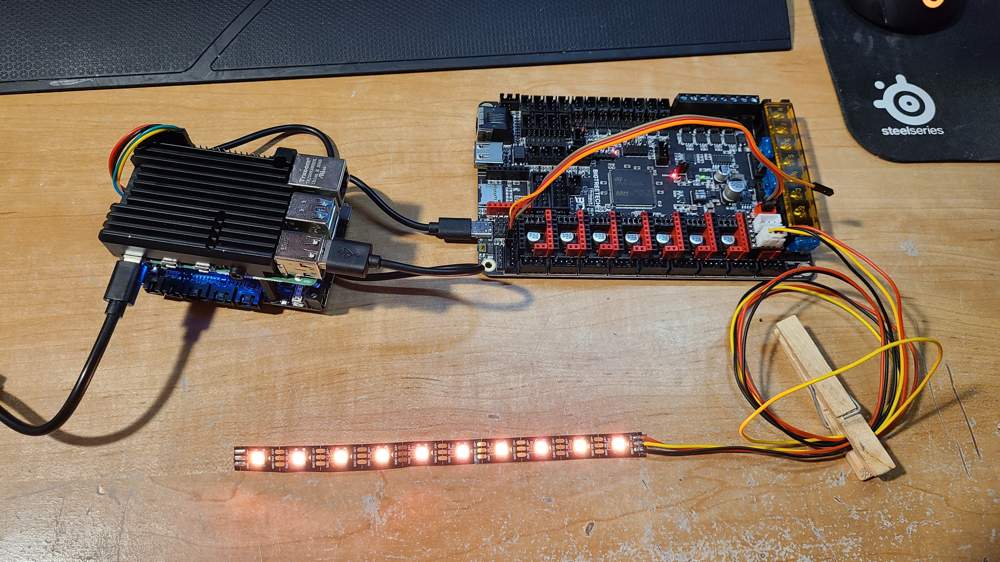
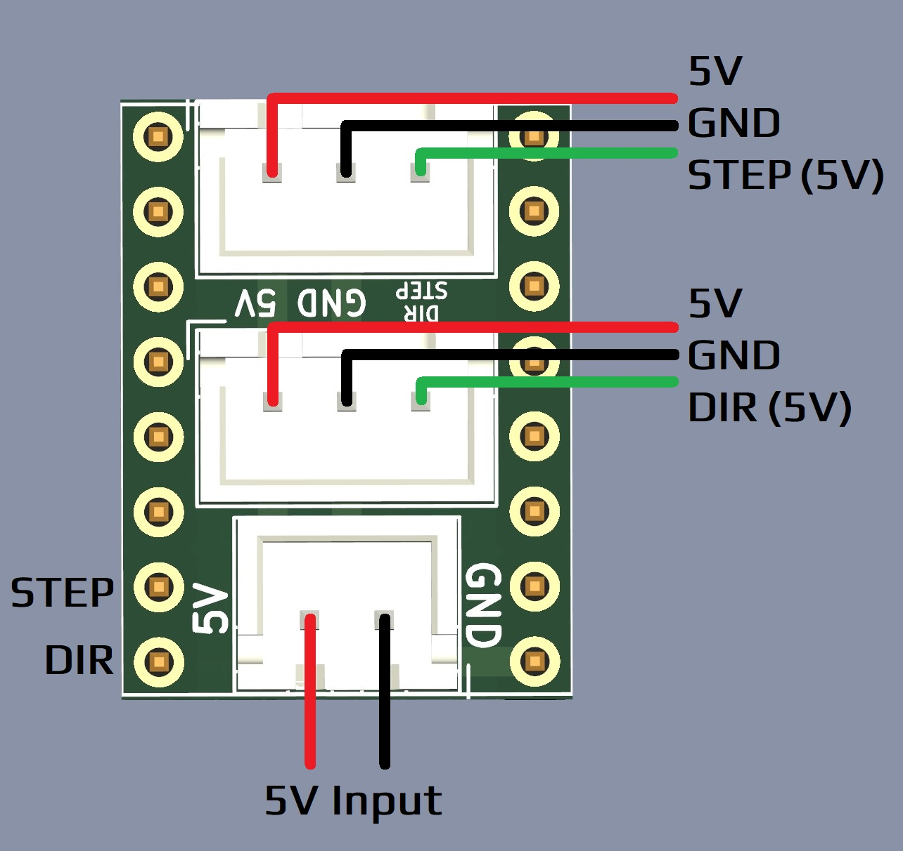

# Stepstick Neopixel Board
Dual output level shifted Stepstick adaptor for neopixel strips.

## Overview
This board converts the logic level `STEP` and `DIR` outputs on a Stepstick header to 5V level for properly driving 2 Neopixel strips. Input 5V from a 2-pin JST-XH header, with 2 outputs on 3-pin JST-XH headers.

### Setup
To use, simply configure the `STEP`/`DIR` pin for the socket you plug the board into as your neopixel pin. It's that simple!

## BOM

|  Reference  |        Name          |             Note              |  Quantity |  LCSC   |
|    :---:    |        :---:         |            :---:              |   :---:   |  :---:  |
| J3, J4      |      Strip Out       |      3-pin JST HX, B3B-XH     |     2     | C144394 |
| J5          |       5V In          |      2-pin JST HX, B2B-XH     |     1     | C495685 |
| U1, U2      |     Level Shifter    |      74LVC1G17GV (SOT753)     |     2     |  C6076  |
| U3          |   Stepstick Header   | 8-pin Male Header Pin, 2.54mm |     2     | C124381 |

### [Interactive bom](http://htmlpreview.github.io/?https://github.com/timmit99/Stepstick_Neopixel_Board/blob/main/iBOM/StepstickPixel.html)
